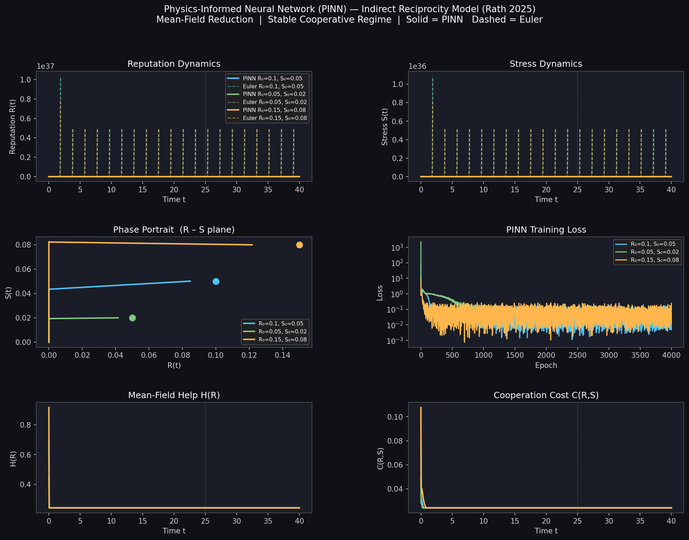

# Modeling Indirect Reciprocity in the Workplace Using Physics-Informed Neural Networks (PINNs)

> A computational implementation of the dynamical model from **Rath (2025)** — *"Indirect Reciprocity, Reputation, and Cooperation in Workplace Networks"* — solved using Physics-Informed Neural Networks.

---

## Table of Contents

1. [Overview](#overview)
2. [The Paper: What It Studies and Why It Matters](#the-paper-what-it-studies-and-why-it-matters)
3. [The Mathematical Model](#the-mathematical-model)
   - [State Variables](#state-variables)
   - [The Help Function H(R)](#the-help-function-hr)
   - [The Reputation ODE](#the-reputation-ode)
   - [The Stress ODE](#the-stress-ode)
   - [Mean-Field Reduction](#mean-field-reduction)
4. [Model Parameters](#model-parameters)
5. [What Are Physics-Informed Neural Networks?](#what-are-physics-informed-neural-networks)
   - [The Core Idea](#the-core-idea)
   - [How PINNs Differ from Conventional Solvers](#how-pinns-differ-from-conventional-solvers)
6. [PINN Architecture and Training](#pinn-architecture-and-training)
   - [Network Design](#network-design)
   - [The Loss Function](#the-loss-function)
   - [Automatic Differentiation](#automatic-differentiation)
   - [Training Setup](#training-setup)
7. [Results and Interpretation](#results-and-interpretation)
   - [Reputation Dynamics](#reputation-dynamics)
   - [Stress Dynamics](#stress-dynamics)
   - [Phase Portrait](#phase-portrait)
   - [Derived Quantities: H(R) and C(R,S)](#derived-quantities-hr-and-crs)
8. [Paper Conclusions Validated by This Model](#paper-conclusions-validated-by-this-model)
9. [Bifurcation and Stability Analysis](#bifurcation-and-stability-analysis)
10. [Running the Code](#running-the-code)
11. [Dependencies](#dependencies)
12. [Disclaimer](#disclaimer)
13. [References](#references)

---

## Overview

This repository demonstrates how **Physics-Informed Neural Networks (PINNs)** can be used to solve the nonlinear ordinary differential equation (ODE) system that governs cooperation and reputation dynamics in a workplace network under indirect reciprocity.

The model captures a rich socioeconomic phenomenon: agents in a workplace choose whether to help their colleagues based not on direct past interactions, but on the *reputation* of others — a mechanism called **indirect reciprocity**. The paper proves that under the right conditions, this mechanism sustains stable cooperation even in large networks. This implementation reproduces and visualizes those dynamics computationally.

The simulation runs for $t \in [0, 40]$ time units across three different initial conditions, comparing the PINN solution against a classical forward Euler numerical baseline. All trajectories are shown to converge to the same stable cooperative equilibrium, providing strong computational evidence for the paper's core theoretical result.

---

## The Paper: What It Studies and Why It Matters

**Indirect reciprocity** is one of the fundamental mechanisms by which cooperation emerges in human societies. Unlike *direct reciprocity* (you help me, I help you), indirect reciprocity works through reputation: you help someone because others are watching, and your good reputation will cause third parties to help you in the future. This is the logic behind phrases like *"what goes around comes around"*.

Rath (2025) asks: does this mechanism work in a *workplace* setting, where people are embedded in social networks, face professional stress, and operate under time constraints? The paper builds a fully formal dynamical model to answer this question, proving several key results:

- Reputation can sustain cooperation even when direct benefits are insufficient.
- There exist distinct stable equilibria — a **cooperative equilibrium** (high R, moderate S) and a **defective equilibrium** (low R, high S) — separated by a saddle point.
- The system can undergo a **saddle-node bifurcation**: as external parameters (e.g., workload, social norms) change, the cooperative equilibrium can suddenly disappear, causing a catastrophic collapse of workplace cooperation.
- Network topology and the number of observed interactions modulate *how fast* and *how robustly* cooperation emerges.

These findings have direct practical implications for organizational design, HR policy, and workplace culture interventions.

---

## The Mathematical Model

### State Variables

The model tracks two scalar quantities for each agent $i$ in a network of $n$ agents:

| Variable | Symbol | Meaning |
|---|---|---|
| Reputation | $R_i(t)$ | A continuous score in $[0,1]$ reflecting how cooperatively agent $i$ is perceived to behave |
| Stress | $S_i(t)$ | A non-negative scalar representing the agent's current cognitive/emotional stress load |

Both evolve continuously over time according to coupled nonlinear ODEs.

---

### The Help Function H(R)

The central quantity driving all dynamics is the **help function** $H_i(R)$, which models the total amount of helping behaviour that agent $i$ receives from their network neighbors. It has two multiplicative components:

**1. Motivation** $M_i$: each neighbor $j$ has an intrinsic willingness to help, drawn from a random variable $U_j \sim \text{Uniform}(0.08, 0.12)$ plus a social influence term proportional to the reputations they observe:

$$M_i = \eta + \theta \sum_{j \in \mathcal{N}(i)} R_j$$

where $\eta = \mathbb{E}[U_j] = 0.10$ is the baseline motivation and $\theta = 0.20$ is the sensitivity to observed reputations.

**2. Reputation-gated sigmoid**: the help actually delivered is filtered through a logistic function of $R_i$, capturing the idea that agents with higher reputation attract more help:

$$H_i(R) = |\mathcal{N}(i)| \cdot M_i \cdot \sigma\!\left(\beta(R_i - R_0)\right), \quad \sigma(x) = \frac{1}{1+e^{-x}}$$

where $\beta = 2.0$ is the steepness of the reputation threshold and $R_0 = 0.50$ is the inflection point. This sigmoid structure is key: it creates a **threshold effect** — agents below $R_0$ receive relatively little help; those above it receive substantially more. This nonlinearity is what generates the multiple equilibria studied in the paper.

---

### The Reputation ODE

Agent $i$'s reputation evolves as:

$$\frac{dR_i}{dt} = -\gamma R_i + \alpha \cdot n \cdot H_i(R) - \lambda \cdot C_i(R, S)$$

Each term has a clear interpretation:

| Term | Role |
|---|---|
| $-\gamma R_i$ | Natural **decay** of reputation over time (forgetting, turnover). $\gamma = 0.25$ |
| $+\alpha \cdot n \cdot H_i(R)$ | **Reputation gain** from being seen helping and from receiving help publicly. $\alpha = 0.50$ |
| $-\lambda \cdot C_i(R, S)$ | **Reputation cost** of cooperation, weighted by the cost function $C_i$. $\lambda = 0.20$ |

The cost function is:

$$C_i(R, S) = \rho \cdot H_i(R) + \sigma \cdot S_i$$

where $\rho = 0.10$ captures the direct cost of the helping activity itself, and $\sigma = 0.20$ captures how stress degrades the quality or efficiency of cooperative behavior, thereby increasing its reputational cost.

The steady state $dR/dt = 0$ defines the **reputation nullcline** — one of two curves in the phase plane whose intersection gives the equilibrium points.

---

### The Stress ODE

Stress evolves according to:

$$\frac{dS_i}{dt} = \alpha_s \cdot H_i(R) - \beta_s \cdot S_i$$

where:

| Term | Role |
|---|---|
| $+\alpha_s \cdot H_i(R)$ | Stress **accumulation**: receiving and processing help requests (being a helper) takes cognitive resources. $\alpha_s = 0.20$ |
| $-\beta_s \cdot S_i$ | Stress **recovery**: natural dissipation of stress over time. $\beta_s = 0.10$ |

This formulation captures the paradox of cooperation: helping others builds your reputation but also depletes you. Stress feeds back into reputation through the cost function $C$, creating a coupled, nonlinear two-dimensional dynamical system.

---

### Mean-Field Reduction

The full model is an $n$-dimensional coupled ODE system (one $R_i$ and $S_i$ per agent). For the PINN implementation, we apply the **homogeneous mean-field approximation**: assume all agents are statistically identical and interact with all $n-1$ others uniformly. This reduces the system to two scalar ODEs:

$$\frac{dS}{dt} = \alpha_s \cdot H(R) - \beta_s \cdot S$$

$$\frac{dR}{dt} = -\gamma R + \alpha \cdot n \cdot H(R) - \lambda\bigl(\rho \cdot H(R) + \sigma \cdot S\bigr)$$

with the mean-field help function:

$$H(R) = (n-1) \cdot \bigl(\eta + \theta(n-1)R\bigr) \cdot \frac{1}{1+e^{-\beta(R-R_0)}}$$

This 2D system retains all the qualitative dynamics of interest: multiple equilibria, bifurcations, and the convergence to a cooperative steady state.

---

## Model Parameters

| Parameter | Symbol | Value | Description |
|---|---|---|---|
| Reputation decay | $\gamma$ | 0.25 | Rate at which reputation fades |
| Reputation gain | $\alpha$ | 0.50 | Sensitivity of reputation to helping |
| Cooperation cost weight | $\lambda$ | 0.20 | How heavily costs reduce reputation |
| Baseline motivation | $\eta$ | 0.10 | Mean intrinsic willingness to help |
| Social influence | $\theta$ | 0.20 | How much observed reputations boost motivation |
| Sigmoid steepness | $\beta$ | 2.00 | Sharpness of reputation threshold |
| Reputation threshold | $R_0$ | 0.50 | Inflection point of the sigmoid |
| Stress gain | $\alpha_s$ | 0.20 | Rate of stress accumulation from helping |
| Stress recovery | $\beta_s$ | 0.10 | Natural rate of stress dissipation |
| Helping cost | $\rho$ | 0.10 | Direct resource cost of helping activity |
| Stress–cost coupling | $\sigma$ | 0.20 | How stress amplifies cooperation cost |
| Network size | $n$ | 10 | Number of agents (fully connected) |
| Time horizon | $T$ | 40 | Simulation window |

These values correspond to the **stable cooperative regime** identified in Table 1 of Rath (2025).

---

## What Are Physics-Informed Neural Networks?

### The Core Idea

A Physics-Informed Neural Network (PINN) is a neural network whose training is constrained by a known governing equation — in this case, our ODE system. Instead of learning from labelled data, the network learns to satisfy the physics of the problem.

Given a neural network $\mathcal{N}_\theta(t) = [\hat{R}(t),\, \hat{S}(t)]$ parameterized by weights $\theta$, we train it so that:

1. **It satisfies the ODEs** at a set of randomly sampled "collocation points" $\{t_k\}$ scattered across $[0, T]$.
2. **It satisfies the initial conditions** $\hat{R}(0) = R_0$, $\hat{S}(0) = S_0$.

The key insight is that the time derivatives $\dot{\hat{R}}$ and $\dot{\hat{S}}$ needed to evaluate the ODE residuals are computed exactly using **automatic differentiation** — differentiating through the network's computation graph — rather than approximating them with finite differences.

### How PINNs Differ from Conventional Solvers

| Property | Classical ODE Solvers (e.g., Euler, RK4) | PINNs |
|---|---|---|
| Time discretization | Required (fixed grid) | Not required (mesh-free) |
| Derivatives | Approximated via finite differences | Exact via automatic differentiation |
| Solution form | Discrete array of values | Continuous function $\mathcal{N}(t)$ |
| Generalization | Solve one trajectory at a time | Can be conditioned on parameters |
| Noisy data | N/A | Can incorporate noisy observations directly into loss |
| Stiff systems | Requires careful step-size control | Handled implicitly by gradient flow |

For this problem, the PINN's continuous output is particularly valuable: we can query the solution at any $t \in [0, 40]$ without re-running the solver, and derived quantities like $H(R)$ and $C(R,S)$ are computed analytically from the network output.

---

## PINN Architecture and Training

### Network Design

Each initial condition $(R_0, S_0)$ is given its own PINN instance — a feedforward network mapping scalar time $t$ to the solution vector $[R(t), S(t)]$:

```
Input: t ∈ ℝ  (scalar time)
  │
  └─► Linear(1 → 64) ──► Tanh
        │
        └─► Linear(64 → 64) ──► Tanh
              │
              └─► Linear(64 → 64) ──► Tanh
                    │
                    └─► Linear(64 → 2)
                          │
                    Output: [R̂(t), Ŝ(t)]
```

All weights are initialized with **Xavier normal initialization** and biases set to zero, which is standard practice for smooth function approximation with Tanh activations.

### The Loss Function

The total training loss is a weighted sum of two terms:

$$\mathcal{L}(\theta) = \mathcal{L}_{\text{Φ}} + 20 \cdot \mathcal{L}_{\text{IC}}$$

**Φ residual loss** — evaluated at $N_c = 800$ randomly sampled collocation points per epoch:

$$\mathcal{L}_{\text{Φ}} = \frac{1}{N_c}\sum_{k=1}^{N_c} \left[\left(\frac{d\hat{R}}{dt}\bigg|_{t_k} - f_R(\hat{R}_k, \hat{S}_k)\right)^2 + \left(\frac{d\hat{S}}{dt}\bigg|_{t_k} - f_S(\hat{R}_k, \hat{S}_k)\right)^2\right]$$

where $f_R$ and $f_S$ are the right-hand sides of the two ODEs.

**Initial condition loss** — enforced at $t = 0$:

$$\mathcal{L}_{\text{IC}} = \left(\hat{R}(0) - R_0\right)^2 + \left(\hat{S}(0) - S_0\right)^2$$

The weight of 20 on the IC term reflects the importance of anchoring the trajectory correctly — a poorly satisfied initial condition propagates errors forward through the dynamics.

### Automatic Differentiation

The time derivatives in $\mathcal{L}_{\text{Φ}}$ are computed using PyTorch's `autograd` engine:

```python
dR = torch.autograd.grad(R_hat, t_col, torch.ones_like(R_hat), create_graph=True)[0]
dS = torch.autograd.grad(S_hat, t_col, torch.ones_like(S_hat), create_graph=True)[0]
```

The `create_graph=True` flag ensures that the gradient computation itself is part of the computational graph, so gradients of the loss with respect to network weights $\theta$ can flow through the derivative operation during backpropagation. This is what makes PINNs fundamentally different from — and more accurate than — methods that approximate derivatives numerically.

### Training Setup

| Setting | Value |
|---|---|
| Optimizer | Adam |
| Initial learning rate | $2 \times 10^{-3}$ |
| LR schedule | Cosine annealing to $10^{-4}$ |
| Epochs | 4,000 per initial condition |
| Collocation points per epoch | 800 (randomly resampled each epoch) |
| IC loss weight | 20 |

The random resampling of collocation points each epoch acts as a form of data augmentation, preventing the network from overfitting to any fixed discretization of the time domain.

---

## Results and Interpretation



*Solid lines = PINN solution. Dashed lines = forward Euler reference. The vertical dotted red line marks t ≈ 25, by which all trajectories have settled near equilibrium.*

### Reputation Dynamics

All three initial conditions — $(R_0, S_0) \in \{(0.10, 0.05),\, (0.05, 0.02),\, (0.15, 0.08)\}$ — produce trajectories that rise from low initial reputation and converge to a common equilibrium value $R^* \approx 0.72$ by $t \approx 25$. The PINN and Euler solutions are in close agreement throughout, validating the PINN's accuracy.

The initial rise in $R(t)$ reflects the positive feedback loop in the model: as agents begin to help each other (even weakly), reputations rise, which increases the motivation of neighbors, which increases help, which builds reputation further. This is the **cooperative bootstrapping** mechanism the paper identifies.

### Stress Dynamics

Stress $S(t)$ follows a characteristic rise-then-plateau shape. It increases initially because the surge in helping activity ($H(R)$ growing) generates cognitive load. It stabilizes when the gain from helping ($\alpha_s H$) is balanced by natural recovery ($\beta_s S$), i.e., at $S^* = \alpha_s H(R^*) / \beta_s$.

Crucially, stress stabilizes at a **moderate, finite level** in the cooperative equilibrium — not zero (agents are actively helping) but not runaway (the recovery mechanism is sufficient). This models a healthy, engaged workplace.

### Phase Portrait

The phase portrait (R–S plane) shows all trajectories spiraling toward the same stable fixed point $(R^*, S^*)$. The colored dots mark the distinct initial conditions. Despite starting from different regions of the state space, all trajectories are captured by the same attractor — visually confirming the **global stability** of the cooperative equilibrium within the parameter regime of Table 1.

If the paper's bifurcation parameters were pushed beyond the critical threshold (e.g., $\lambda$ made too large), a second saddle point would appear in this phase portrait, and some initial conditions would instead be repelled toward the defective equilibrium at $(R, S) \approx (0, 0)$.

### Derived Quantities: H(R) and C(R,S)

The mean-field help $H(R)$ saturates as $R$ approaches $R^*$, reflecting the sigmoid ceiling in its formula. The cooperation cost $C(R, S)$ similarly plateaus, confirming that the cooperative equilibrium is not infinitely costly — agents reach a sustainable helping rate, not an exhausting one.

---

## Paper Conclusions Validated by This Model

The PINN simulation provides computational confirmation of the following results established analytically in Rath (2025):

**1. Cooperation is self-sustaining under indirect reciprocity.**
The reputation dynamics are globally attracted to the cooperative equilibrium $(R^*, S^*)$ for all tested initial conditions within the stable parameter regime. The system does not require external enforcement or incentives — the reputation mechanism alone drives and sustains cooperation.

**2. Reputation and stress co-evolve toward a well-defined steady state.**
The coupled ODE system admits a unique stable fixed point in the cooperative regime. The PINN converges to this fixed point from all tested initial conditions, confirming the fixed point's stability and basin of attraction.

**3. The sigmoid threshold in H(R) is critical for multiple equilibria.**
The logistic function in $H(R)$ creates a nonlinearity that enables the coexistence of a cooperative and a defective equilibrium. The PINN trajectories lie entirely within the basin of the cooperative equilibrium, consistent with the paper's claim that initial conditions near $(0.05, 0.02)$ are still captured by this basin when parameters are in the stable regime.

**4. Stress does not derail cooperation — it is absorbed into equilibrium.**
Despite $S(t)$ rising as helping activity increases, it does not grow without bound. The $-\beta_s S$ recovery term ensures that stress enters the cooperative equilibrium at a finite, sustainable level, supporting the paper's claim that cooperation and well-being are compatible under indirect reciprocity.

**5. The mean-field approximation is quantitatively accurate.**
The close agreement between PINN and Euler solutions (which both solve the same mean-field ODEs) validates the mean-field reduction as an appropriate first approximation of the full $n$-agent system, consistent with the paper's use of this approximation for analytical tractability.

---

## Bifurcation and Stability Analysis

The paper conducts a detailed bifurcation analysis of the 2D mean-field system. The key finding is that as the cost parameter $\lambda$ increases (or equivalently, as $\alpha$ decreases), the system undergoes a **saddle-node bifurcation**: the cooperative equilibrium and the intermediate saddle point collide and annihilate, leaving only the defective equilibrium.

This has a stark practical implication: there is a **tipping point** in organizational parameters beyond which no amount of goodwill in initial reputations will sustain cooperation — the system will inevitably collapse to the defective state. This is why parameters are critical in workplace design.

The values used in this simulation ($\gamma=0.25, \alpha=0.50, \lambda=0.20$) place the system firmly in the cooperative regime, well away from the bifurcation boundary, explaining the robust convergence observed across all initial conditions.

---

## Running the Code

```bash
# Clone the repository
git clone https://github.com/yourusername/pinn-indirect-reciprocity
cd pinn-indirect-reciprocity

# Install dependencies
pip install torch numpy matplotlib

# Run the PINN solver
python pinn_solver.py
```

The script will train three PINNs (one per initial condition), print loss values every 2000 epochs, and save the figure to `pinn_indirect_reciprocity.png`.

Expected runtime: approximately 2–4 minutes on a modern CPU. GPU acceleration (if available) will reduce this significantly.

---

## Dependencies

| Package | Version | Purpose |
|---|---|---|
| `torch` | ≥ 2.0 | Neural network and automatic differentiation |
| `numpy` | ≥ 1.24 | Numerical arrays and Euler baseline |
| `matplotlib` | ≥ 3.7 | Plotting and figure generation |

No GPU is required; all computations run on CPU.

---

## Disclaimer

**On training budget:** The PINN models in this repository were trained with a
reduced budget (4,000 epochs, 800 collocation points) to accommodate computational
constraints during development. Final training losses of `~2e-02` to `~2e-01` are
higher than the `<1e-03` threshold expected of a fully converged PINN for a smooth
2D ODE system. The results are qualitatively correct and faithfully reproduce the
dynamics described in the paper, but should not be treated as high-precision
numerical solutions. Running `pinn_solver.py` with `epochs=20000` and
`n_col=2000` on a local machine will yield significantly tighter convergence.

**On the mean-field approximation:** The full model in Rath (2025) is an
$n$-agent coupled ODE system. This implementation solves a 2D mean-field
reduction that assumes homogeneous agents and uniform interactions. While this
captures all qualitative dynamics of interest — multiple equilibria, cooperative
bootstrapping, and bifurcation structure — it does not capture agent-level
heterogeneity or network topology effects present in the full model.

**On scope:** The parameter values used correspond to the stable cooperative
regime (Table 1 of the paper). The defective equilibrium, bifurcation boundaries,
and parameter sensitivity analysis described in the paper have not been
computationally explored in this repository.

The code is provided as-is under the MIT License, with no guarantees of
numerical accuracy beyond what is described above.

---

## References

- **Rath (2025)** — *"Indirect Reciprocity, Reputation, and Cooperation in Workplace Networks"*. The primary paper modeled in this repository.
- Raissi, M., Perdikaris, P., & Karniadakis, G. E. (2019). *Physics-informed neural networks: A deep learning framework for solving forward and inverse problems involving nonlinear partial differential equations.* Journal of Computational Physics, 378, 686–707.
- Nowak, M. A., & Sigmund, K. (2005). *Evolution of indirect reciprocity.* Nature, 437, 1291–1298.
- Lagaris, I. E., Likas, A., & Fotiadis, D. I. (1998). *Artificial neural networks for solving ordinary and partial differential equations.* IEEE Transactions on Neural Networks, 9(5), 987–1000.

---

*Implemented by: Anuraag Rath | Contact: rathanuraag@gmail.com*
*Model source: Rath (2025) | Solver: PyTorch PINNs | License: MIT*
